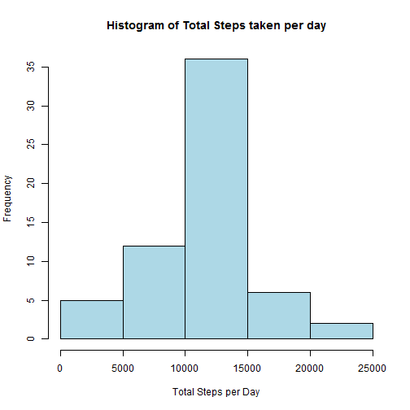
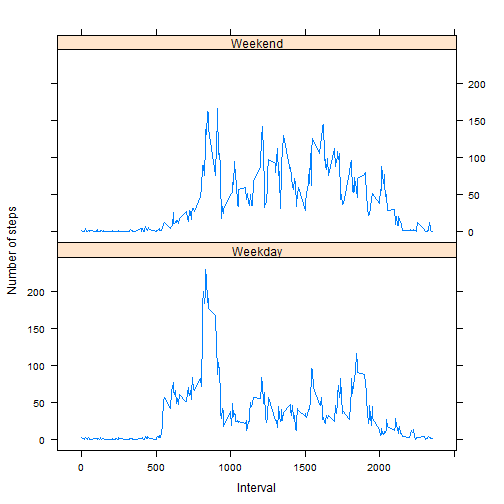

# Reproducible Research: Peer Assessment 1
### Dineshsrb
========================================================

### Step:1 Loading and preprocessing the data
* Loading the csv data activity.csv and preview of data set

```r
activityData <- read.csv("activity.csv")
head(activityData)
```

```
##   steps       date interval
## 1    NA 2012-10-01        0
## 2    NA 2012-10-01        5
## 3    NA 2012-10-01       10
## 4    NA 2012-10-01       15
## 5    NA 2012-10-01       20
## 6    NA 2012-10-01       25
```

```r
str(activityData)
```

```
## 'data.frame':	17568 obs. of  3 variables:
##  $ steps   : int  NA NA NA NA NA NA NA NA NA NA ...
##  $ date    : Factor w/ 61 levels "2012-10-01","2012-10-02",..: 1 1 1 1 1 1 1 1 1 1 ...
##  $ interval: int  0 5 10 15 20 25 30 35 40 45 ...
```


* Convert date to R date class and verify using str


```r
activityData$date <- as.Date(activityData$date, "%Y-%m-%d")
str(activityData)
```

```
## 'data.frame':	17568 obs. of  3 variables:
##  $ steps   : int  NA NA NA NA NA NA NA NA NA NA ...
##  $ date    : Date, format: "2012-10-01" "2012-10-01" ...
##  $ interval: int  0 5 10 15 20 25 30 35 40 45 ...
```


### Step:2 What is mean total number of steps taken per day?
* Make a histogram of the total number of steps taken each day after calculating
total number of steps taken each day

```r
totalStepsPerday <- tapply(activityData$steps, activityData$date, sum)
hist(totalStepsPerday, col = "steel blue", xlab = "Total Steps per Day", ylab = "Frequency", 
    main = "Histogram of Total Steps taken per day")
```

 

* Calculate and report the mean and median total number of steps taken per day

```r
mean <- mean(totalStepsPerday, na.rm = TRUE)
median <- median(totalStepsPerday, na.rm = TRUE)
```

* The **mean** of total number of steps taken per day = 1.0766 &times; 10<sup>4</sup>

* The **median** of total number of steps taken per day = 10765

### Step:3 What is the average daily activity pattern?
* Calculate average of steps over all days by time interval, Make a Time series plot of the 5-minute interval and the average number of steps taken, averaged across all days

```r
avgSteps <- tapply(activityData$steps, activityData$interval, mean, na.rm = TRUE)
plot(row.names(avgSteps), avgSteps, type = "l", xlab = "Time Interval", ylab = "Avg number of steps taken across all Days", 
    main = "Avg number of Steps Taken at different 5 minute Intervals", col = "red")
```

 

* Which 5-minute interval, on average across all the days in the data set, 
contains the maximum number of steps

```r
avgMaxSteps <- which.max(avgSteps)
avgMaxStepsInterval <- names(avgMaxSteps)
avgMaxStepsInterval
```

```
## [1] "835"
```

* The time interval 835 has the maximum number of steps on average across all the days (maximum average number of steps= 104)

### Step: 4 Imputing missing values
* Calculate and report the total number of missing values in the data set

```r
totalNA <- sum(is.na(activityData))
```

* The total number of rows with NAs = 2304

* Fill in missing values using the mean interval value across all days, Create 
a new data set that is equal to the original data set but with the missing data filled in

```r
na <- which(is.na(activityData))
imputedData <- avgSteps[as.character(activityData[na, 3])]
names(imputedData) <- na
for (i in na) {
    activityData$steps[i] = imputedData[as.character(i)]
}
sum(is.na(activityData))
```

```
## [1] 0
```

* The new data set "activityData" has no NAs

* Make a histogram of the total number of steps taken each day for the new data set "activityData" 


```r
totalStepsPerday <- tapply(activityData$steps, activityData$date, sum)
hist(totalStepsPerday, col = "light blue", xlab = "Total Steps per Day", ylab = "Frequency", 
    main = "Histogram of Total Steps taken per day")
```

 


* Calculate and report the mean and median total number of steps taken per day. Do these values differ from the estimates from the first part of the assignment? What is the impact of imputing missing data on the estimates of the total daily number of steps?

```r
mean1 <- mean(totalStepsPerday)
median1 <- median(totalStepsPerday)
```


* The **mean** of total number of steps taken per day after imputation = 1.0766 &times; 10<sup>4</sup>

* The **median** of total number of steps taken per day after imputation = 1.0766 &times; 10<sup>4</sup>

* The mean before and after imputation is same and in case of median the difference is negligible, so the impact of imputing missing data on the estimates of the total daily number of steps is **insignificant or negligible**

### Step 5: Are there differences in activity patterns between weekdays and weekends?
* Create a new factor variable in the data set with two levels -- "weekday" and "weekend" indicating whether a given date is a weekday or weekend day.


```r
days <- weekdays(activityData$date)
activityData$dayType <- ifelse(days == "Saturday" | days == "Sunday", "Weekend", 
    "Weekday")
avgSteps <- aggregate(activityData$steps, by = list(activityData$interval, activityData$dayType), 
    mean)
names(avgSteps) <- c("interval", "dayType", "steps")
```


* Make a panel plot containing a time series plot (i.e. type = "l") of the 5-minute interval (x-axis) and the average number of steps taken, averaged across all weekday days or weekend days (y-axis)


```r
library(lattice)  ## loading lattice package
xyplot(steps ~ interval | dayType, avgSteps, type = "l", layout = c(1, 2), xlab = "Interval", 
    ylab = "Number of steps")
```

 

* Additionally, Let's compute the summary statistics of avg steps across all intervals and days by Weekdays/Weekends

```r
tapply(avgSteps$steps, avgSteps$dayType, summary)
```

```
## $Weekday
##    Min. 1st Qu.  Median    Mean 3rd Qu.    Max. 
##    0.00    2.25   25.80   35.60   50.90  230.00 
## 
## $Weekend
##    Min. 1st Qu.  Median    Mean 3rd Qu.    Max. 
##    0.00    1.24   32.30   42.40   74.70  167.00
```

* From the plot and summary statistics it can be concluded that there is a clear difference in activity patterns between weekdays and weekends

### End of the assignment
